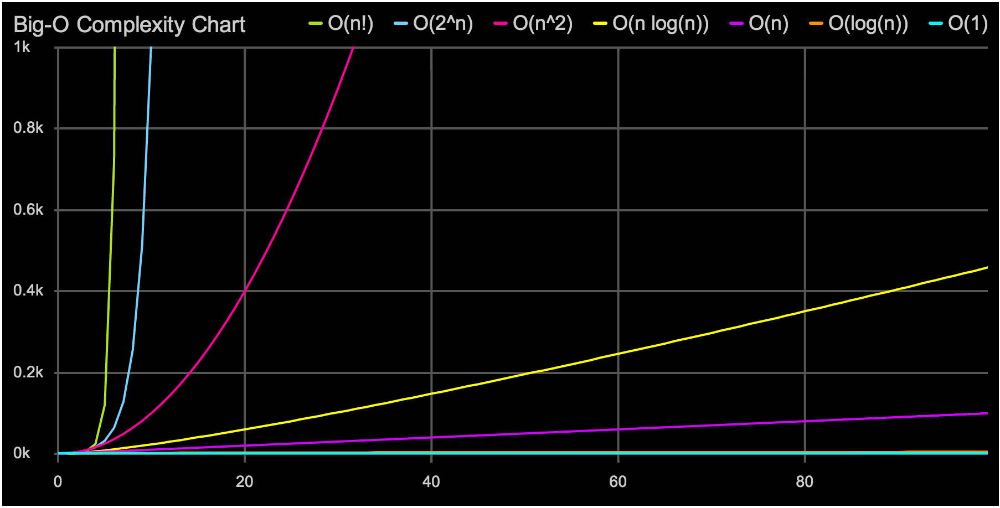
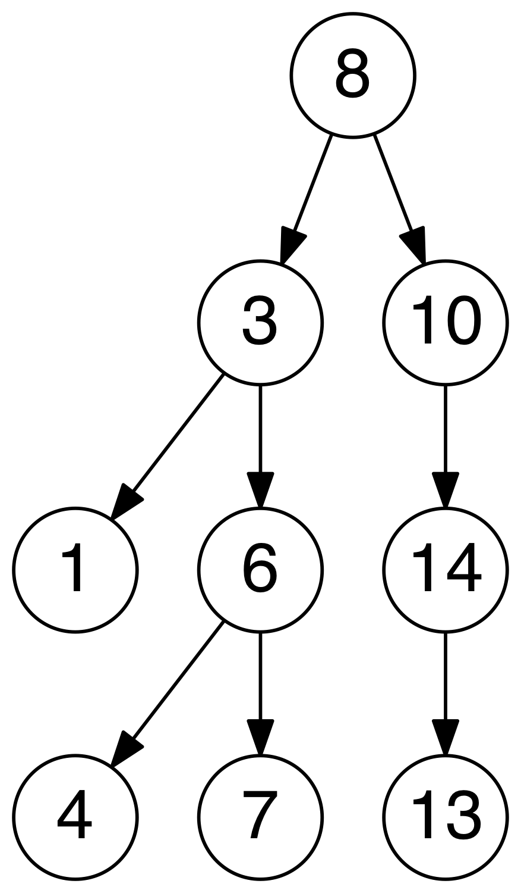
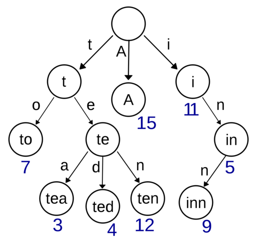
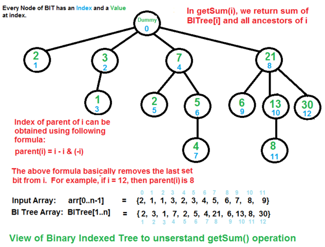
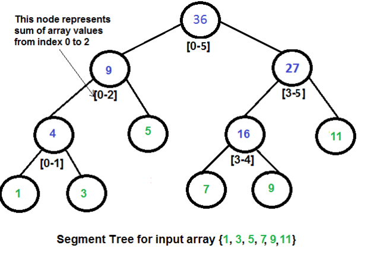
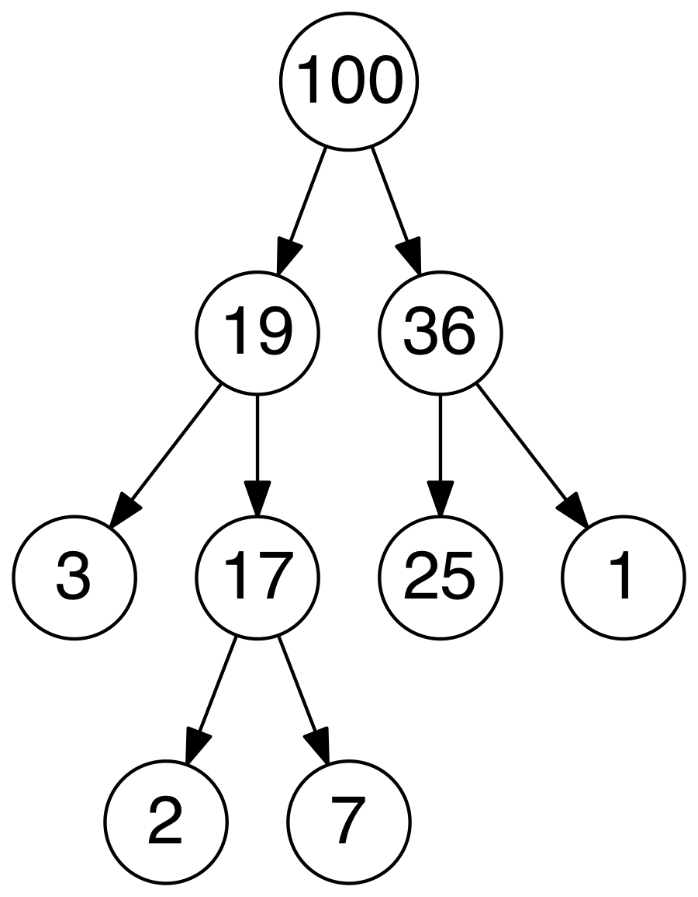
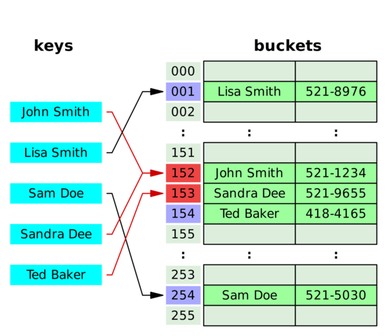
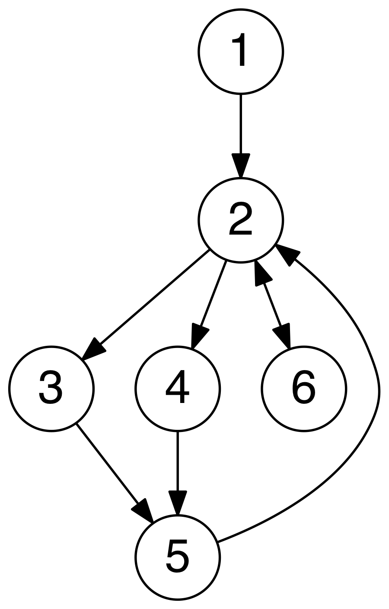

# Data Structures and Algorithms

## Big O Notation

#### Big-O Complexity Chart


#### Constant — statement (one line of code)

```java
a += 1;
```

Growth Rate: **1**

#### Logarithmic — divide in half (binary search)

```java
while (n > 1) {
  n = n / 2;
}
```

Growth Rate: **log(n)**

#### Linear — loop

```java
for (int i = 0; i < n; i++) {
  // statements
  a += 1;
}
```

Growth Rate: **n**

The loop executes `N` times, so the sequence of statements also executes `N` times. If we assume the statements are `O(1)`, the total time for the for loop is `N * O(1)`, which is `O(N)` overall.

#### Quadratic — Effective sorting algorithms

```
Mergesort, Quicksort, …
```

Growth Rate: **n*log(n)**

#### Quadratic — double loop (nested loops)

```java
for (int c = 0; c < n; c++) {
  for (int i = 0; i < n; i++) {
    // sequence of statements
    a += 1;
  }
}
```

Growth Rate: **n^2**

The outer loop executes N times. Every time the outer loop executes, the inner loop executes `M` times. As a result, the statements in the inner loop execute a total of `N * M` times. Thus, the complexity is `O(N * M)`.
In a common special case where the stopping condition of the inner loop is `J < N` instead of `J < M` (i.e., the inner loop also executes `N` times), the total complexity for the two loops is `O(N2)`.

#### Cubic — triple loop

```java
for (c = 0; c < n; c++) {
  for (i = 0; i < n; i++) {
    for (x = 0; x < n; x++) {
      a += 1;
    }
  }
}
```

Growth Rate: **n^3**

#### Exponential — exhaustive search

```
Trying to break a password generating all possible combinations
```

Growth Rate: **2^n**

##### If-Then-Else

``` java
if (cond) {
  block 1 (sequence of statements)
} else {
  block 2 (sequence of statements)
}
```

If `block 1` takes `O(1)` and `block 2` takes `O(N)`, the `if-then-else` statement would be `O(N)`.

##### Statements with function/ procedure calls

When a statement involves a function/ procedure call, the complexity of the statement includes the complexity of the function/ procedure. Assume that you know that function/procedure `f` takes constant time, and that function/procedure `g` takes time proportional to (linear in) the value of its parameter `k`. Then the statements below have the time complexities indicated.

`f(k)` has `O(1)`
`g(k)` has `O(k)`

When a loop is involved, the same rule applies. For example:

```
for J in 1 .. N loop
  g(J);
end loop;
```

has complexity `(N2)`. The loop executes N times and each function/procedure call `g(N)` is complexity `O(N)`.

## Algorithms
## Simple Sorting

### Bubble Sort


The bubble sort is notoriously slow, but it’s conceptually the simplest of the sorting algorithms.

##### Sorting process

1. Compare two items.
2. If the one on the left is bigger, swap them.
3. Move one position right.

##### Efficiency

For `10` data items, this is `45` comparisons (`9 + 8 + 7 + 6 + 5 + 4 + 3 + 2 + 1`).

In general, where `N` is the number of items in the array, there are `N-1` comparisons on the first pass, `N-2` on the second, and so on. The formula for the sum of such a series is
`(N–1) + (N–2) + (N–3) + ... + 1 = N*(N–1)/2 N*(N–1)/2 is 45 (10*9/2)` when `N` is `10`.

### Selection Sort


The selection sort improves on the bubble sort by reducing the number of swaps necessary from `O(N2)` to `O(N)`. Unfortunately, the number of comparisons remains `O(N2)`. However, the selection sort can still offer a significant improvement for large records that must be physically moved around in memory, causing the swap time to be much more important than the comparison time.

##### Efficiency

The selection sort performs the same number of comparisons as the bubble sort: `N*(N-1)/2`. For `10` data items, this is `45` comparisons. However, `10` items require fewer than `10` swaps. With `100` items, `4,950` comparisons are required, but fewer than `100` swaps. For large values of `N`, the comparison times will dominate, so we would have to say that the selection sort runs in `O(N2)` time, just as the bubble sort did.

### Insertion Sort


In most cases the insertion sort is the best of the elementary sorts described in this chapter. It still executes in `O(N2)` time, but it’s about twice as fast as the bubble sort and somewhat faster than the selection sort in normal situations. It’s also not too complex, although it’s slightly more involved than the bubble and selection sorts. It’s often used as the final stage of more sophisticated sorts, such as quicksort.

##### Efficiency

How many comparisons and copies does this algorithm require? On the first pass, it compares a maximum of one item. On the second pass, it’s a maximum of two items, and so on, up to a maximum of N-1 comparisons on the last pass. This is `1 + 2 + 3 + ... + N-1 = N*(N-1)/2`

However, because on each pass an average of only half of the maximum number of items are actually compared before the insertion point is found, we can divide by 2, which gives `N*(N-1)/4`

The number of copies is approximately the same as the number of comparisons. However, a copy isn’t as time-consuming as a swap, so for random data this algorithm runs twice as fast as the bubble sort and faster than the selection sort.

In any case, like the other sort routines in this chapter, the insertion sort runs in `O(N2)` time for random data.

For data that is already sorted or almost sorted, the insertion sort does much better. When data is in order, the condition in the while loop is never true, so it becomes a simple statement in the outer loop, which executes `N-1` times. In this case the algorithm runs in `O(N)` time. If the data is almost sorted, insertion sort runs in almost `O(N)` time, which makes it a simple and efficient way to order a file that is only slightly out of order.

## Advanced Sorting

### Merge Sort


mergesort is a much more efficient sorting technique than those we saw in "Simple Sorting", at least in terms of speed. While the bubble, insertion, and selection sorts take `O(N2)` time, the mergesort is `O(N*logN)`.

For example, if `N` (the number of items to be sorted) is `10,000`, then `N2` is `100,000,000`, while `N*logN` is only `40,000`. If sorting this many items required `40` seconds with the mergesort, it would take almost `28` hours for the insertion sort.

The mergesort is also fairly easy to implement. It’s conceptually easier than quicksort and the Shell short.

The heart of the mergesort algorithm is the merging of two already-sorted arrays. Merging two sorted arrays `A` and `B` creates a third array, `C`, that contains all the elements of `A` and `B`, also arranged in sorted order.

Similar to quicksort the list of element which should be sorted is divided into two lists. These lists are sorted independently and then combined. During the combination of the lists the elements are inserted (or merged) on the correct place in the list.

You divide the half into two quarters, sort each of the quarters, and merge them to make a sorted half.

##### Sorting process

1. Assume the size of the left array is k, the size of the right array is m and the size of the total array is n (=k+m).
2. Create a helper array with the size n
3. Copy the elements of the left array into the left part of the helper array. This is position 0 until k-1.
4. Copy the elements of the right array into the right part of the helper array. This is position k until m-1.
5. Create an index variable i=0; and j=k+1
6. Loop over the left and the right part of the array and copy always the smallest value back into the original array. Once i=k all values have been copied back the original array. The values of the right array are already in place.

##### Efficiency

As we noted, the mergesort runs in `O(N*logN)` time. There are `24` copies necessary to sort `8` items. `Log28` is `3`, so `8*log28` equals `24`. This shows that, for the case of `8` items, the number of copies is proportional to `N*log2N`.

In the mergesort algorithm, the number of comparisons is always somewhat less than the number of copies.

##### Comparison with Quicksort

Compared to quicksort the mergesort algorithm puts less effort in dividing the list but more into the merging of the solution.

Quicksort can sort "inline" of an existing collection, e.g. it does not have to create a copy of the collection while Standard mergesort does require a copy of the array although there are (complex) implementations of mergesort which allow to avoid this copying.

### Quick Sort


Quicksort is undoubtedly the most popular sorting algorithm, and for good reason: In the majority of situations, it’s the fastest, operating in `O(N*logN)` time. (This is only true for internal or in-memory sorting; for sorting data in disk files, other algorithms may be better.)

To understand quicksort, you should be familiar with the partitioning algorithm.

Quicksort algorithm operates by partitioning an array into two sub-arrays and then calling itself recursively to quicksort each of these subarrays.

##### Sorting process

If the array contains only one element or zero elements then the array is sorted.

If the array contains more then one element then:

1. Select an element from the array. This element is called the "pivot element". For example select the element in the middle of the array.
2. All elements which are smaller then the pivot element are placed in one array and all elements which are larger are placed in another array.
3. Sort both arrays by recursively applying Quicksort to them.
4. Combine the arrays.

Quicksort can be implemented to sort "in-place". This means that the sorting takes place in the array and that no additional array need to be created.

##### Efficiency

Quicksort operates in `O(N*logN)` time. This is generally true of the divide-and-conquer algorithms, in which a recursive method divides a range of items into two groups and then calls itself to handle each group. In this situation the logarithm actually has a base of `2`: The running time is proportional to `N*log2N`.

##### Standard Java Array sorting

Java offers a standard way of sorting Arrays with `Arrays.sort()`. This sort algorithm is a modified quicksort which show more frequently a complexity of `O(n log(n))`. See the Javadoc for details.

## Data Structures

### Linked List
 * A *Linked List* is a linear collection of data elements, called nodes, each
   pointing to the next node by means of a pointer. It is a data structure
   consisting of a group of nodes which together represent a sequence.
 * **Singly-linked list**: linked list in which each node points to the next node and the last node points to null
 * **Doubly-linked list**: linked list in which each node has two pointers, p and n, such that p points to the previous node and n points to the next node; the last node's n pointer points to null
 * **Circular-linked list**: linked list in which each node points to the next node and the last node points back to the first node
 * Time Complexity:
   * Access: `O(n)`
   * Search: `O(n)`
   * Insert: `O(1)`
   * Remove: `O(1)`

### Stack
 * A *Stack* is a collection of elements, with two principle operations: *push*, which adds to the collection, and
   *pop*, which removes the most recently added element
 * **Last in, first out data structure (LIFO)**: the most recently added object is the first to be removed
 * Time Complexity:
   * Access: `O(n)`
   * Search: `O(n)`
   * Insert: `O(1)`
   * Remove: `O(1)`

### Queue
 * A *Queue* is a collection of elements, supporting two principle operations: *enqueue*, which inserts an element
   into the queue, and *dequeue*, which removes an element from the queue
 * **First in, first out data structure (FIFO)**: the oldest added object is the first to be removed
 * Time Complexity:
   * Access: `O(n)`
   * Search: `O(n)`
   * Insert: `O(1)`
   * Remove: `O(1)`

### Tree
 * A *Tree* is an undirected, connected, acyclic graph

### Binary Tree
 * A *Binary Tree* is a tree data structure in which each node has at most two children, which are referred to as
   the *left child* and *right child*
 * **Full Tree**: a tree in which every node has either 0 or 2 children
 * **Perfect Binary Tree**: a binary tree in which all interior nodes have two children and all leave have the same depth
 * **Complete Tree**: a binary tree in which every level *except possibly the last* is full and all nodes in the last
   level are as far left as possible

### Binary Search Tree
 * A binary search tree, sometimes called BST, is a type of binary tree which maintains the property that the value in each
   node must be greater than or equal to any value stored in the left sub-tree, and less than or equal to any value stored
   in the right sub-tree
 * Time Complexity:
   * Access: `O(log(n))`
   * Search: `O(log(n))`
   * Insert: `O(log(n))`
   * Remove: `O(log(n))`



### Trie
* A trie, sometimes called a radix or prefix tree, is a kind of search tree that is used to store a dynamic set or associative
  array where the keys are usually Strings. No node in the tree stores the key associated with that node; instead, its position 
  in the tree defines the key with which it is associated. All the descendants of a node have a common prefix of the String associated 
  with that node, and the root is associated with the empty String.



### Fenwick Tree
* A Fenwick tree, sometimes called a binary indexed tree, is a tree in concept, but in practice is implemented as an implicit data
  structure using an array. Given an index in the array representing a vertex, the index of a vertex's parent or child is calculated
  through bitwise operations on the binary representation of its index. Each element of the array contains the pre-calculated sum of
  a range of values, and by combining that sum with additional ranges encountered during an upward traversal to the root, the prefix
  sum is calculated
* Time Complexity:
  * Range Sum: `O(log(n))`
  * Update: `O(log(n))`



### Segment Tree
* A Segment tree, is a tree data structure for storing intervals, or segments. It allows querying which of the stored segments contain
  a given point
* Time Complexity:
  * Range Query: `O(log(n))`
  * Update: `O(log(n))`



### Heap
* A *Heap* is a specialized tree based structure data structure that satisfies the *heap* property: if A is a parent node of
B, then the key (the value) of node A is ordered with respect to the key of node B with the same ordering applying across the entire heap.
A heap can be classified further as either a "max heap" or a "min heap". In a max heap, the keys of parent nodes are always greater
than or equal to those of the children and the highest key is in the root node. In a min heap, the keys of parent nodes are less than
or equal to those of the children and the lowest key is in the root node
* Time Complexity:
  * Access Max / Min: `O(1)`
  * Insert: `O(log(n))`
  * Remove Max / Min: `O(log(n))`




### Hashing
* *Hashing* is used to map data of an arbitrary size to data of a fixed size. The values returned by a hash
  function are called hash values, hash codes, or simply hashes. If two keys map to the same value, a collision occurs
* **Hash Map**: a *hash map* is a structure that can map keys to values. A hash map uses a hash function to compute
  an index into an array of buckets or slots, from which the desired value can be found.
* Collision Resolution
 * **Separate Chaining**: in *separate chaining*, each bucket is independent, and contains a list of entries for each index. The
 time for hash map operations is the time to find the bucket (constant time), plus the time to iterate through the list
 * **Open Addressing**: in *open addressing*, when a new entry is inserted, the buckets are examined, starting with the
 hashed-to-slot and proceeding in some sequence, until an unoccupied slot is found. The name open addressing refers to
 the fact that the location of an item is not always determined by its hash value




### Graph
* A *Graph* is an ordered pair of G = (V, E) comprising a set V of vertices or nodes together with a set E of edges or arcs,
  which are 2-element subsets of V (i.e. an edge is associated with two vertices, and that association takes the form of the
  unordered pair comprising those two vertices)
 * **Undirected Graph**: a graph in which the adjacency relation is symmetric. So if there exists an edge from node u to node
 v (u -> v), then it is also the case that there exists an edge from node v to node u (v -> u)
 * **Directed Graph**: a graph in which the adjacency relation is not symmetric. So if there exists an edge from node u to node v
 (u -> v), this does *not* imply that there exists an edge from node v to node u (v -> u)




# Top 10 Object Oriented Design Principles

1. **DRY (Don't repeat yourself)** — avoids duplication in code
2. **Encapsulate what changes** — hides implementation detail, helps in maintenance
3. **Open Closed design principle** — open for extension, closed for modification
4. **SRP (Single Responsibility Principle)** — one class should do one thing and do it well
5. **DIP (Dependency Inversion Principle)** — don't ask, let framework give to you
6. **Favor Composition over Inheritance** — code reuse without cost of inflexibility
7. **LSP (Liskov Substitution Principle)** — sub type must be substitutable for super type
8. **ISP (Interface Segregation Pricinciple)** — avoid monilithic interface, reduce pain on client side
9. **Programming for Interface** — helps in maintenance, improves flexibility
10. **Delegation principle** — don't do all things by yourself, delegate it

### Sources

1. [Data Structures and Algorithms in Java, second edition by Robert Lafore](http://rineshpk.weebly.com/uploads/1/8/2/0/1820991/data_structures_and_algorithms_in_javatqw_darksiderg.pdf)
2. [10 Object Oriented Design Principles Java Programmer should know](http://javarevisited.blogspot.com/2012/03/10-object-oriented-design-principles.html)
3. [Design Patterns](http://www.oodesign.com/)
4. [Algorithms for Dummies (Part 1): Big-O Notation and Sorting](http://adrianmejia.com/blog/2014/02/13/algorithms-for-dummies-part-1-sorting/)
5. [Big O notation](http://web.mit.edu/16.070/www/lecture/big_o.pdf)
6. [A beginner's guide to Big O notation](https://rob-bell.net/2009/06/a-beginners-guide-to-big-o-notation/)
7. [Big O Notation. Using not-boring math to measure code's efficiency](https://www.interviewcake.com/article/big-o-notation-time-and-space-complexity)
8. [Understanding Algorithm complexity, Asymptotic and Big-O notation](http://www.codenlearn.com/2011/07/understanding-algorithm-complexity.html)
9. [Big-O Algorithm Complexity Cheat Sheet](http://bigocheatsheet.com)
10. [Algorithms in Java](http://www.vogella.com/tutorials/JavaAlgorithms/article.html)
11. [Mergesort in Java](http://www.vogella.com/tutorials/JavaAlgorithmsMergesort/article.html)
12. [Quicksort in Java](http://www.vogella.com/tutorials/JavaAlgorithmsQuicksort/article.html)